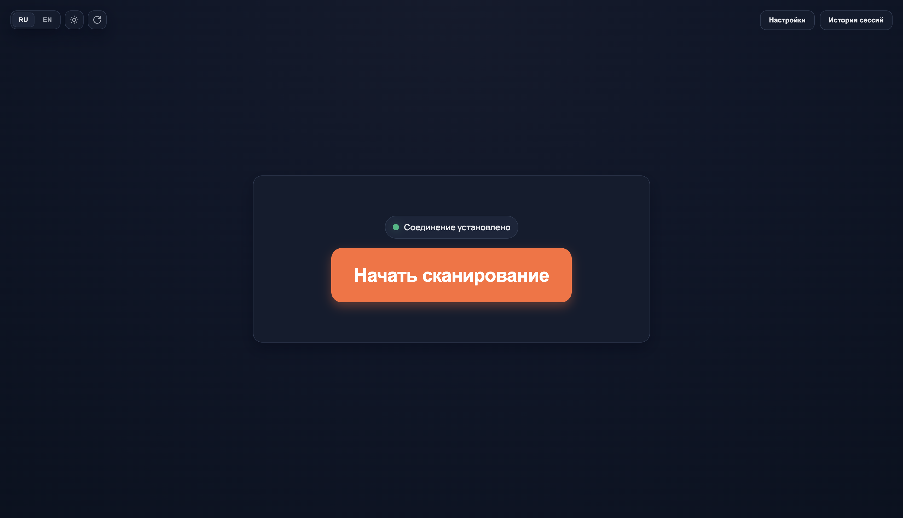
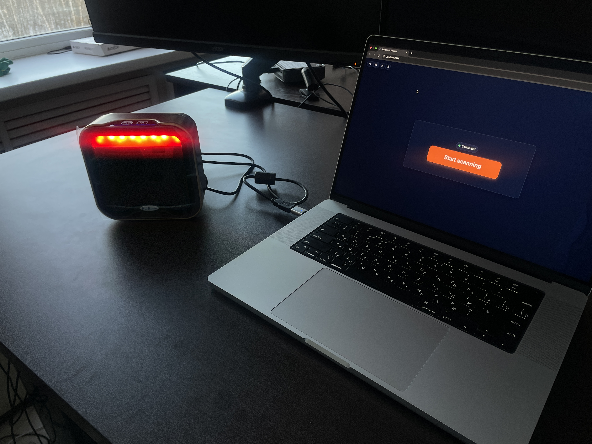

# Barcode Reader

## Список технологий

- Frontend: React 18 + TypeScript + Vite
- Backend: FastAPI + Pydantic + Uvicorn
- База данных: SQLite + SQLAlchemy (async)
- Работа с Excel: openpyxl
- Работа со сканером: pyserial
- Реалтайм: WebSocket (`/ws`)
- Desktop-обвязка: Electron

## Памятка по запуску

### 1) Запуск backend

```bash
cd backend
python -m venv .venv
source .venv/bin/activate  # Windows: .venv\Scripts\activate
pip install -r requirements.txt
python -m uvicorn main:app --reload --host localhost --port 8059
```

### 2) Запуск frontend

```bash
# из корня проекта
npm install
npm run dev
```

Frontend по умолчанию работает с backend `http://localhost:8059` и WebSocket `ws://localhost:8059/ws`.

### 3) Сборка web-версии

```bash
npm run build:web
```

## CI/CD (GitHub Actions)

- При пуше тега формата `v*` в GitHub (например, `v1.0.0`) автоматически запускается workflow `.github/workflows/build-desktop.yml`, который собирает Windows-инсталлятор (`.exe`) и публикует его в артефакты/Release.

## Демонстрационные материалы

- Видеодемонстрация: [app/docs/demonstration.mp4](docs/demonstration.mp4)

### Стартовая страница



### Демонстрация рабочего места (условного) оператора


