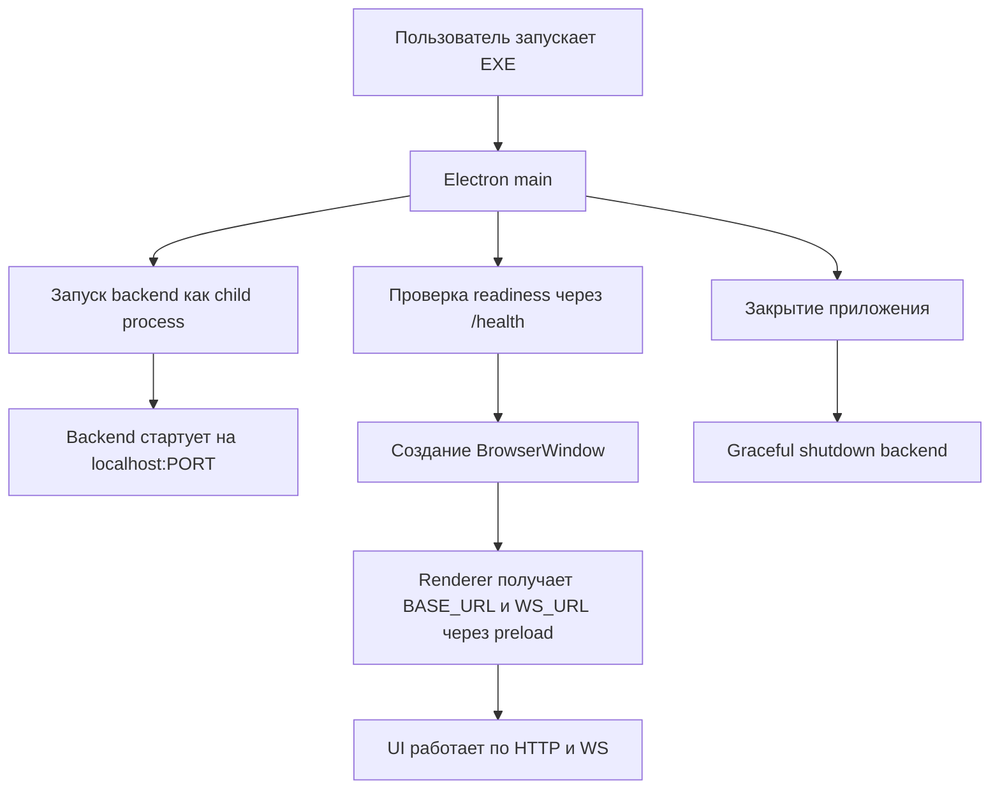

# Схема упаковки в один EXE: только Вариант A (Electron orchestrates Python)

Цель: пользователь запускает один EXE, Electron поднимает Python-backend, ждет готовности и открывает UI.

## Архитектура

## Почему это финальный выбор

- Простая и контролируемая оркестрация в `main` процессе Electron.
- Быстрый и надежный контроль жизненного цикла backend.
- Удобная диагностика: stdout/stderr backend централизованно пишутся в логи приложения.
- Минимальный операционный риск по сравнению с embedded/runtime service сценариями.

## Контракт запуска

1. Electron запускает backend бинарник через `spawn`.
2. Backend стартует с параметрами:
    - `--host 127.0.0.1`
    - `--port <выделенный порт>`
    - `--token <одноразовый токен сессии>`
3. Electron ждет готовности:
    - проверка `GET /health` каждые 250-500 мс;
    - общий таймаут 20-30 секунд;
    - при timeout показывается окно ошибки с кнопкой "Перезапустить backend".
4. После readiness Electron создает окно и передает renderer:
    - `BASE_URL=http://127.0.0.1:<port>`
    - `WS_URL=ws://127.0.0.1:<port>/ws`
    - `SESSION_TOKEN=<одноразовый токен>`

## Порт и коллизии

- Не использовать жестко фиксированный порт.
- Выбирать свободный порт в Electron перед запуском backend.
- Передавать этот порт в backend аргументом процесса.
- Renderer не хранит порт в editable-настройках, получает его только от preload/IPC.

## Безопасность локального канала

- Использовать одноразовый токен запуска (генерируется в Electron на старте).
- Передавать токен:
    - в заголовке HTTP (`X-App-Token`),
    - в query/header для WS.
- Backend отклоняет запросы без валидного токена.
- Слушать только `127.0.0.1` (не `0.0.0.0`).

## Graceful shutdown

- При `before-quit` Electron отправляет backend сигнал завершения.
- Ждет до 5 секунд завершения процесса.
- Если backend не завершился, выполняет принудительную остановку.
- На Windows учитывать завершение дерева процессов backend.

## Логирование и диагностика

- Логи backend писать в файл в директории данных приложения.
- Логи Electron и backend коррелировать по `run_id` (генерируется при старте EXE).
- В UI выводить только короткое сообщение об ошибке и кнопку "Открыть логи".

## Обновления и совместимость

- EXE обновляется атомарно (Electron updater).
- Версия web-клиента и backend проверяется при старте:
    - несовместимые версии -> понятная ошибка + предложение обновления.
- Миграции БД запускать на старте backend до readiness.

## Пошаговый план реализации

1. Подготовить backend к запуску как упакованный бинарник (PyInstaller/аналог).
2. Добавить в backend параметры запуска `host/port/token`.
3. Реализовать middleware проверки токена для HTTP/WS.
4. В Electron main реализовать:
    - выбор свободного порта;
    - запуск backend;
    - цикл ожидания `/health`;
    - retry/restart при сбое старта.
5. В preload добавить безопасную передачу `BASE_URL`, `WS_URL`, `SESSION_TOKEN`.
6. Перевести web-клиент на использование runtime-конфигурации из preload (без редактирования пользователем URL).
7. Реализовать корректное завершение backend при закрытии приложения.
8. Добавить централизованные логи и экран ошибки запуска.
9. Собрать единый инсталлятор и проверить сценарии:
    - чистый старт,
    - занятый порт,
    - падение backend при старте,
    - завершение приложения,
    - повторный запуск после crash.

## Критерии готовности (Definition of Done)

- Пользователь запускает один EXE и видит готовый UI без ручного старта backend.
- Backend стабильно поднимается и останавливается вместе с приложением.
- URL/WS не редактируются пользователем, подставляются автоматически.
- При любой ошибке старта есть понятное сообщение и доступ к логам.
- Отработаны smoke-тесты упаковки на целевой ОС.

---

## План реализации сборки в GitHub Actions

Цель CI/CD: автоматически проверять код, собирать desktop-дистрибутив и публиковать артефакты сборки.

## Структура workflows

1. `.github/workflows/ci.yml`:
    - запускается на `pull_request` и `push` в `main`;
    - выполняет проверки backend и web-клиента;
    - блокирует merge при падении тестов/линтеров.
2. `.github/workflows/build-desktop.yml`:
    - запускается на `tag` (`v*`) и вручную через `workflow_dispatch`;
    - собирает backend бинарник, web bundle и итоговый portable desktop `.exe` для Windows;
    - публикует артефакты и (для тега) релиз.

## Пошаговый план реализации

1. Подготовить репозиторий к CI:
    - добавить папку `.github/workflows/`;
    - зафиксировать зависимости (`backend/requirements.txt`, `package-lock.json`).
2. Реализовать `ci.yml`:
    - job `backend-checks`: `python`, установка зависимостей, линт, тесты;
    - job `web-checks`: `node`, `npm ci`, `npm run build`, тесты/линт;
    - кэширование `pip` и `npm` для ускорения.
3. Реализовать `build-desktop.yml` (только Windows):
    - runner `windows-latest`;
    - сборка backend в `.exe` (PyInstaller);
    - сборка web-клиента (`npm ci && npm run build:web`);
    - упаковка через `electron-builder` в один portable `.exe` с включением backend-бинарника.
4. Настроить передачу артефактов между job:
    - `actions/upload-artifact` для итогового desktop `.exe` и checksum;
    - отдельный артефакт итоговой Windows-сборки (`.exe` + `.sha256`).
5. Настроить релизы:
    - при теге `vX.Y.Z` публиковать GitHub Release;
    - прикладывать Windows installer и checksum (`SHA256`).
6. Добавить проверку smoke-сценария после сборки:
    - запуск приложения в headless/минимальном режиме;
    - проверка старта backend и ответа `/health`.
7. Включить контроль качества:
    - required status checks для `ci.yml`;
    - защита `main` от merge при красном CI.

## Секреты и переменные GitHub

- `GH_TOKEN` для публикации релизов (если не используется встроенный `GITHUB_TOKEN`).
- `CSC_LINK`, `CSC_KEY_PASSWORD` (опционально) для code signing Windows.
- `APP_ID`, `PUBLISH_CHANNEL` как repository variables.

## Политика версионирования

- Версия берется из git tag `vX.Y.Z`.
- Один tag = одна воспроизводимая сборка.
- Nightly/preview сборки делать через `workflow_dispatch` с prerelease-флагом.

## Команды сборки (локально, Windows)

- Установить зависимости backend и сборщик:
    - `pip install -r backend/requirements.txt`
    - `pip install pyinstaller`
- Установить зависимости web-клиента и desktop toolchain:
    - `npm ci`
    - `npm install --no-save electron electron-builder`
- Собрать единый portable `.exe`:
    - `npm run build:desktop:win`
- Результат:
    - `release/*.exe`

## Критерии готовности (Definition of Done) для GitHub Actions

- Любой PR автоматически проходит проверки backend и web-клиента.
- По тэгу `vX.Y.Z` собирается и публикуется рабочий installer для Windows.
- Артефакты сборки доступны в Actions и в GitHub Release.
- При сбое сборки логи достаточно детализированы для диагностики без локального воспроизведения.
